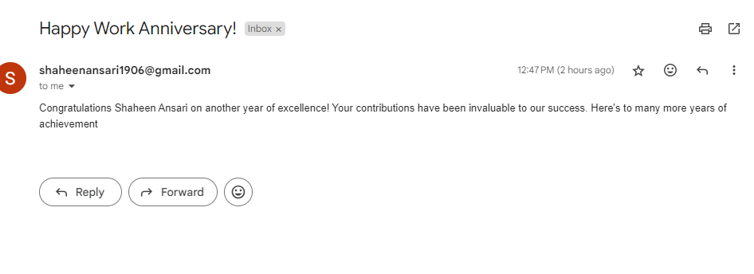
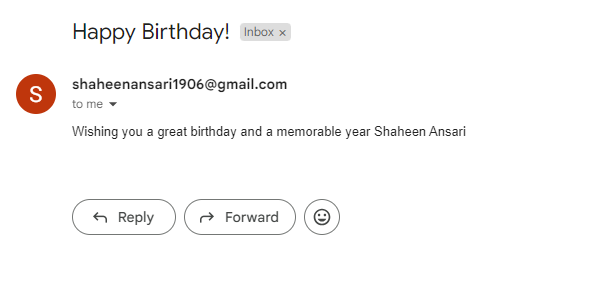

# Django Event Email System


## Getting Started

### Installation

1. Clone this repository to your local machine:
   ```
   git clone https://github.com/Shaheen1906/Automate_email_sent.git
   ```

2. Navigate to the project directory:
   ```
   cd Automate_email_sent
   ```

3. Install dependencies using pip:
   ```
   pip install -r requirements.txt
   ```

### Usage

1. Start the Django development server:
   ```
   python manage.py runserver
   ```

2. Open a web browser and navigate to the following URL to access the browsable API interface:
   ```
   http://localhost:8000/
   ```

3. Use the provided API endpoints as follows:

- **Manage Employee Details:**
  - **Endpoint:** `/employees/`
  - **Method:** POST (Create), GET (List)
  - **Description:** Use this endpoint to add new employee details or retrieve existing employee details.

- **Retrieve, Update, or Delete Individual Employee Details:**
  - **Endpoint:** `/employees/<int:pk>/`
  - **Method:** GET (Retrieve), PUT (Update), DELETE (Delete)
  - **Description:** Use this endpoint to retrieve, update, or delete individual employee details by their primary key.

- **Create and Manage Email Templates:**
  - **Endpoint:** `/emailtemplate/`
  - **Method:** POST (Create), GET (List)
  - **Description:** Use this endpoint to create new email templates or retrieve existing email templates.

- **Retrieve, Update, or Delete Individual Email Templates:**
  - **Endpoint:** `/emailtemplate/<int:pk>/`
  - **Method:** GET (Retrieve), PUT (Update), DELETE (Delete)
  - **Description:** Use this endpoint to retrieve, update, or delete individual email templates by their primary key.

- **Schedule Events (Birthdays, Work Anniversaries):**
  - **Endpoint:** `/events/`
  - **Method:** POST (Create), GET (List)
  - **Description:** Use this endpoint to schedule new events (such as birthdays or work anniversaries) or retrieve existing events.

- **Retrieve, Update, or Delete Individual Events:**
  - **Endpoint:** `/events/<int:pk>/`
  - **Method:** GET (Retrieve), PUT (Update), DELETE (Delete)
  - **Description:** Use this endpoint to retrieve, update, or delete individual events by their primary key.

- **Manage Email Sending Logs:**
  - **Endpoint:** `/email-logs/`
  - **Method:** POST (Create), GET (List)
  - **Description:** Use this endpoint to view email sending logs or create new logs.

- **Retrieve, Update, or Delete Individual Email Sending Logs:**
  - **Endpoint:** `/email-logs/<int:pk>/`
  - **Method:** GET (Retrieve), PUT (Update), DELETE (Delete)
  - **Description:** Use this endpoint to retrieve, update, or delete individual email sending logs by their primary key.

- **Send Event Emails:**
  - **Endpoint:** `http://localhost:8000/`
  - **Method:** POST
  - **Description:** Use this endpoint to trigger the process of sending event emails (birthdays, work anniversaries). Simply click on POST to initiate the process.

4. Authenticate as admin to access admin functionalities:
- `http://localhost:8000/admin/`
  - **Username:** admin
  - **Password:** admin

5. **Output**

